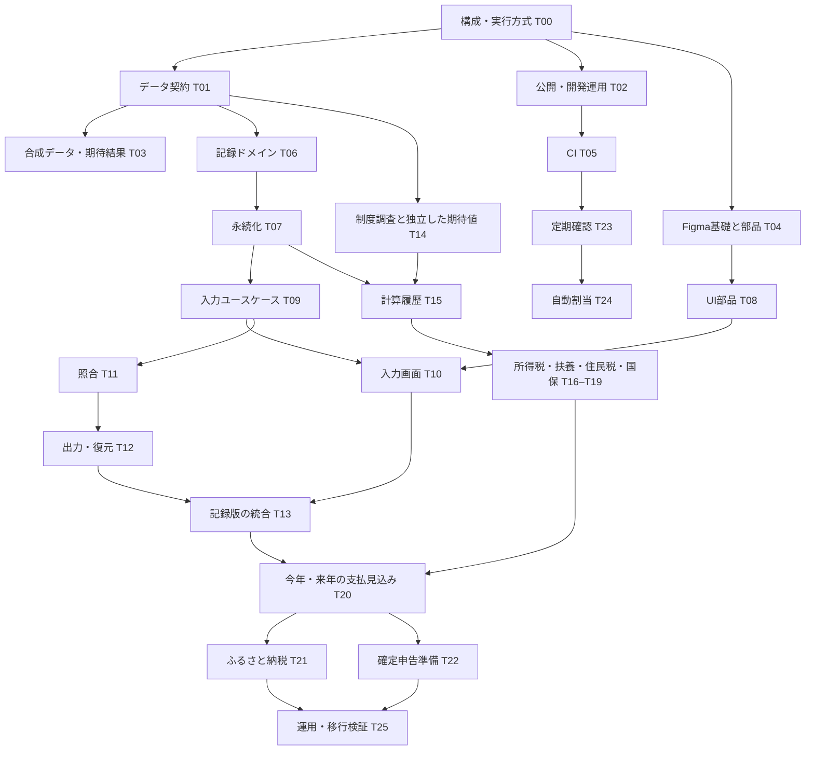

# Kurashi Ledger 実装計画

作成日: 2026-10-02 / 状態: 設計案。実装・公開・定期実行の開始指示ではない。

## この資料の使い方

別のAIは、この資料 → [タスク台帳](implementation-tasks.md) → [GitHub・複数AI運用設計](github-agent-operations.md) の順に読む。タスクIDは設計上の識別子であり、GitHub Issue番号ではない。Issue作成時に対応表を作る。進捗の正本は、運用開始後のGitHub Issue・PRとし、本資料に日々の状態を書き写さない。

このリポジトリで共有しているのは設計資料と作業規約。利用可能なアプリではなく、製品コード・実行可能なActions workflowはまだ公開していない。以前ローカルで用意した基礎コードもT02で棚卸しし、検証してから採用する。Figmaはファイル作成済みだがデザインシステム未作成。タスクIDに対応するGitHub Issueは未作成。現在の実装可否は [project-status.md](project-status.md) を確認する。

## 実装の順番

| 段階 | 完了時にできること | 対象 |
| --- | --- | --- |
| 0. 境界を決める | 技術構成、データ契約、レビュー・担当ルールが揃う | T00–T03 |
| 1. 並行開発の土台 | Figmaの基礎・部品、CI、記録モデル、制度の調査資料が揃う | T04–T08、T14 |
| 2. 記録できる最小版 | 複数勤務先の給与／銀行入金を入力し、照合・訂正・持出し・復元できる | T09–T13 |
| 3. 目先の判断支援 | 扶養確認の進捗、所得税・住民税・国保の試算と支払時期が分かる | T15–T20 |
| 4. 申告準備 | ふるさと納税の試算、確定申告へ渡す情報の整理ができる | T21–T22 |
| 5. 運用を固める | 更新・移行・復元を含むMac/Windowsでの運用手順が揃う | T25 |

T23（定期確認）はT02・T05の後に、製品開発とは並行して導入できる。T24（AIへの自動割当・条件付きマージ）はT23を観察運転してから段階的に有効化する。到達点はユーザーが選んだ「承認済みIssueの実装から条件付きマージまで」。全自動運用の完成を製品の初回利用の前提にしない。

初回利用の区切りはT13。銀行入金だけでも保存できるが、内訳不明の収入を確定給与や税額に見せない。実データを使う前に、保存先の分離と復元試験を完了する。T13時点の税・保険カードは「未対応／必要情報未入力」を示し、仮の税額を表示しない。

## 依存関係の概観

図は概観。個々の必須依存関係・受入条件はタスク台帳を正とする。

## 並行作業の割り当て例

最初は作業者2名を基本、競合しない場合だけ3名まで。調整係は1名。AI製品やアカウントが異なっても同じ運用に従う。

| 波 | 作業者A | 作業者B | 作業者Cを追加する場合 |
| --- | --- | --- | --- |
| 入口 | T00 → T01（順番に契約を確定） | T02はT00完了後 | 未確定の契約を前提に実装しない |
| 土台 | T03 → T06 → T07 | T04 → T08 | T05、T14 |
| 記録 | T09 → T11 → T12 | T09完了後にT10 | T23、制度調査の継続 |
| 判断支援 | T15完了後T17 → T19 | T16 → T18 | T20の画面骨組みは契約・合成データのみで先行可能 |
| 統合 | T20 → T21 | T22 | T24、T25の運用資料準備 |

T16–T19はインターフェースと期待値が確定すれば個別に並行実装できる。実務上は共通の所得・控除モデルの変更が起きやすいため、同時に4名を入れず2名から始める。

## 並行編集を避ける場所

- データ契約、DB migration、依存関係とlockfile、共通デザイントークン、Figmaの同一ライブラリ、CI権限設定は、タスクで共有資源を宣言し同時担当を1名にする。
- AIごとに専用branchとworktreeを使う。同じcheckoutや同じローカル実データDBを共有しない。
- 同一ファイルの別行でも、意味の整合性が必要なら競合として扱う。DB migration番号の重複がないだけでは安全としない。
- 依存PRが未マージなら、そのAPIを見込みで複製しない。初期運用では積み重ねPRを使わず、独立タスクへ移る。
- UI担当が税式を作らず、計算担当が画面構成を固定しない。UIは計算結果の状態と内訳を表示する。

## 技術構成の前提と未決定事項

TypeScriptの小さなモジュール構成を候補の中心に置く。domain / application / infrastructure / UIを分け、Repository・Clock・RuleProvider・CalculatorなどI/O境界へ明示的に依存を渡す。汎用DIコンテナや独自制度DSLは初期範囲に含めない。

T00でローカルブラウザアプリ＋SQLiteを第一候補として評価し、UIフレームワーク、DBドライバ、起動・配布方法、対応ランタイムをADRに確定する。ローカルHTTP方式ならloopback限定、Origin検証など、他サイトから操作されない境界も含める。Mac/Windowsの二台間同期は初期非対応と明記する。初回から常時稼働サーバーや複数サービスを必要とする構成にはしない。

OpenFiscaはE01の評価対象。採用判断前に必須依存へ入れない。将来採用しても計算アダプタ内へ閉じ込め、入力・結果・制度版の共通形式を維持する。

## 作り込みを後回しにするもの

OCR・銀行API、自動確定入力、法人会計・節税シミュレーション、全自治体対応、e-Taxへの直接送信、クラウド同期、スマホ専用アプリは初期範囲外。確定申告はまず転記・確認できる資料を作る。法人化は個人の給与・税・保険と別のモデルが必要なので、要件調査から別Epicにする。

トップ画面は「今年の収入」「扶養の確認・切り替え状況」「今年と来年の支払見込み」「ふるさと納税の目安」を初期案とする。順番やカード追加は表示設定で変更できるようにし、計算処理と結び付けない。

## 実装を始めるときの引継ぎ文

> この計画は設計資料です。実装再開の明示指示と担当割当を確認してから着手してください。最初にT00を完了し、その後T01とT02へ進んでください。自分のIssue、契約版、変更可能な範囲、受入条件を確認し、専用branch/worktreeで作業してください。未確認値を0にせず、実データ・給与明細・会話内容を公開領域へ移さないでください。テスト結果・未対応範囲・次の担当への情報を残してDraft PRを作成し、別担当のレビューへ引き継いでください。マージは有効化済みの運用設定に従い、承認範囲・最新CI・独立レビューを検証する制御側が行います。
