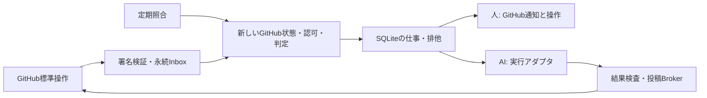

# 人・AI共通のレビュー受付（設計案）

状態: **提案・未実装**。対象は [Issue #45](https://github.com/doc-gif/kurashi-ledger/issues/45)。Codexが設計から実装まで担当し、Claudeが各段階を独立レビューする。設計の受入後に実装PRへ進む。この設計PRはIssueを閉じない。

GitHubの操作を通常のプログラムが受け取り、条件が揃った仕事だけを人・AIへ渡す。モデルに巡回判定や担当の決定をさせない。Webhookを通常の入口、15分ごとの照合を取りこぼし対策として提案する。導入までは現在の定期確認・[PR書式](pr-review-loop.md)を使う。

## 1. 利用者が行う操作

| 操作 | 人・AIに共通の意味 |
| --- | --- |
| Draftで作業し、Ready for reviewへ切り替える | そのhead/baseの作業完了。受付が対象を固定する |
| Request review / Re-request review | 指定した独立レビュワーへ依頼。準備・CIが未完了なら保留 |
| Approve / Request changes、行への指摘 | GitHub標準Reviewを結果の正本にする |
| 修正を開始してDraftへ戻す | 既存の完了報告と実行結果を無効化する |
| 修正push後にReady for reviewへ戻す | 新しい対象で再レビューする。pushだけでは再開しない |
| 所有者が `review:paused` ラベルを付ける | 新規起動・結果採用・投稿を停止する |

人にはSHAやAI用のテンプレートの転記を求めない。検証結果はCI、変更の意図・残件はPR本文で共有する。レビュー依頼だけでは作業完了を表さず、非Draftと対象が固定されたReadyの証拠も必要。最初から非Draftで作成されたPRは、作成イベントのhead/baseを初回Readyとして扱う。

push・base更新・担当変更・pause後の再開では古いReadyを使わない。人が対象を再確認し、Draft→Readyの標準操作で更新する。取りこぼした履歴から対象を特定できない場合も同じ操作を案内する。一般コメントの「完了」から推測しない。

GitHub Appは身元であり役割ではない。人のユーザー/チームへの標準依頼と、Appの実行先への配信を分ける。App botを標準Request reviewに指定できるとは仮定しない。未対応なら、所有者が事前に指定したApp担当へReadyを配信する。人もAIも同じ準備・独立性・承認規則を満たす。

## 2. 配置先と費用

**最初は、所有者のMacに単一のNode.jsプロセスと専用SQLiteを置く。** プログラムはレビュー済みmainの固定版から起動し、PR checkoutから起動しない。製品アプリのDB・HTTPサーバーとは別にする。macOSのサービス管理は所有者が明示的に有効化する。

| 案 | 負担・制約 | 判断 |
| --- | --- | --- |
| ローカル常駐＋既存CLI | 新しいクラウド料金なし。Macの停止中は配信/実行できず、復帰時の照合が必要 | 初期案 |
| クラウド受付＋永続キュー＋ローカルrunner | Mac停止中も受信可能。公開サービス、費用、runner接続と秘密の管理が増える | 稼働実績を見て別途承認 |
| GitHub ActionsからAI起動 | 資格情報とPRコードの分離、二重起動、利用枠の制御が複雑 | 初期案では採用しない |

Node.jsはrepoの対応版を使う。SQLiteは`node:sqlite`を候補とし、対応版のAPI・終了時のDB整合・3 OSでの試験を実装で確認する。WALとトランザクションを使い、同じDBを複数ホストで共有しない。ローカルDB・ログはrepo外に置く。

受信は専用のlocalhost HTTP endpointと、所有者が承認するHTTPSの到達経路に分ける。公開URL/トンネルの提供元・費用・有効化は導入前の所有者判断。受信先が未設定でも照合だけで保留仕事を回復できる。Appを作っただけではデスクトップのチャットは起動しない。

## 3. 境界と認証

- Webhook secretはAppごとに分ける。raw bodyのHMAC-SHA256を定時間比較し、サイズ上限、repo/installation/eventの許可リストを確認する。署名は配送元の証明であり、本文に書かれた指示への許可ではない。
- 署名が正しいイベントを永続化してから2xxを返す。保存失敗は非2xx、過大bodyは413、署名不正は拒否する。イベントは最新状態を取得するきっかけに限る。全必要ページの取得失敗・rate limitはunknownとして止める。
- GitHubへの通信は`gh api`だけ。権限・インストール範囲を確認する既存の[App認証](github-apps.md)を再利用する。GitHub APIの縮小tokenとAIサービスの認証は別物。
- 所有者管理のrepo外の設定で、repo ID、許可PR/Issue、implementer、reviewers、GitHub user ID/App ID、実行先、予算、modeを対応付ける。slug/role本文/ラベルだけで本人確認や着手許可を発行しない。自己申告の担当変更を取り込まない。
- 実装参加者はowner設定に加え、取得できるpush/commit履歴で確認する。作者・push参加者・実装workerとその派生担当は独立レビュワーにしない。履歴や同一人物の別identityを判別できない場合は、所有者が参加者対応を確認するまで保留。
- PR由来の文書・コード・設定は入力データ。reviewerにPR checkoutを作業rootとして渡さず、PRのhooks、MCP、AGENTS等を自動ロードしない。reviewerの入力は取得した差分・指定資料だけ。資格情報付きでPRコードを実行しない。

## 4. 記録と実行状態

GitHubを差分・Review・CIの正本とし、ローカルには配信と実行制御だけを保存する。

| 記録 | 最低限の項目 |
| --- | --- |
| Policy | repo ID、許可範囲、独立した参加者、reviewer集合、必要数、実行先、設定revision、mode |
| Inbox | App ID＋delivery ID（unique）、event、受信時刻、処理状態、期限付きのpayload |
| Target | repo/PR、head、base、Readyのevent参照、policy revision、generation、pause |
| Job | Target＋担当ID＋種類（unique）、queued/launching/running/uncertain/finished/stale、run ID、PIDと開始時刻、session ID、heartbeat、結果参照 |
| Outbox | Job＋投稿種類（unique）、対象commit、本文hash、投稿状態、GitHub review ID、冪等marker |
| Acceptance | GitHub review ID、投稿者ID、state、head/base、取得証跡、成立/取り消し/古い対象 |

DBの移行前に停止・バックアップを確認する。未知schemaは書き込まない。secretを保存しない。payloadは7日で削除、完了Jobの詳細は30日で要約する。実行中・結果不明・未解消の指摘と投稿IDは回復に必要な間保持する。

状態は `waiting → queued → launching → running → result-ready → posted`。完了はGitHub投稿を再取得して確認した後。closed/mergedはfinished、対象変更はstale、pauseは横断状態。失敗の自動再試行は副作用のない取得処理だけに上限を設ける。

同一PRの実装/レビューJobは同時に1つだけ起動する。複数レビュワーは集合として扱い、順番に起動する。他PRは並行可能で、AI reviewer上限は全体10、同じ実行先にも個別上限を設ける。人がReviewを行う操作をこの枠で制限しない。

### 重複・停止・結果不明

1. DBトランザクションでTargetのgenerationとJobのunique制約を確認し、枠を取得してlaunchingを記録する。worker supervisorは同じrun IDを二重に起動しない。
2. 起動応答前に受付が落ちたらuncertainへ戻し、supervisorのrun ID/PID開始時刻/session IDを照合する。見つからないだけでは再起動しない。終了または未起動を確かめられなければ所有者判断へ止める。
3. heartbeatの期限切れは生存不明。古いprocessの終了確認までPRの枠を解放しない。取消要求→停止→process tree終了確認→generation更新の順。SIGKILL等でtokenの失効が未確認なら、その状態も残す。
4. 対象更新・pause・担当交代では結果を採用しない。投稿直前に同じpair/担当/Ready/CI/世代を再取得する。更新中の仕事は停止を要求し、実装Jobの部分変更は担当worktreeに残す。
5. 投稿応答が不明なら、全Reviewとmarker/commit/投稿者/本文hashを再取得する。1件を確認できればposted、重複なら停止して報告、確認不能ならuncertain。成功した可能性のあるPOSTを自動再送しない。

受信順ではなく最新GitHub状態を優先する。一般コメント・自分の投稿を新しい依頼に変換しない。workerはGitHubへ直接投稿せず、結果案だけを返す。再実行を望む人は、新しい対象のReady/再依頼という標準操作を使う。

## 5. 判定とGitHub Review

起動には、owner許可、担当の独立性、Open/non-Draft、同じpairへのReady、最新baseの取り込み、必要CI成功、未処理の依頼が必要。GitHub APIの不明値・欠落・部分取得は合格にしない。

Readyのpull_requestイベントはpayloadのhead/baseと再取得値が一致した場合だけ固定する。遅れて届き対象が違えば破棄する。定期照合は確認済みReadyを再利用できるが、OpenであるだけのPRにReadyを作らない。導入前のPRは一度Draft→Readyで移行する。pauseの解除だけでは新しいReadyを発行しない。

CIは必須のQuality gateと支持ジョブ、試験mergeの親・treeを確認する。check名だけ・古いgreen・workflowの自己変更を信頼しない。trusted policy adapterを固定したmain版から読む。#34/#38の未マージ実装には依存せず、不足分はIssue45の独立レビュー対象として実装する。

| Review操作 | 判定 |
| --- | --- |
| APPROVE | 許可された独立レビュワーで、対象commitと受付のhead/baseが一致した時だけ候補 |
| CHANGES_REQUESTED | 修正待ち。全指摘を原因と固定IDでまとめ、実装担当へ渡す |
| COMMENTED、行コメント | 情報/指摘。本文のacceptedだけで正式承認にしない |
| DISMISSED/edited | 全必要ページを読み直し、有効な承認集合を再計算 |
| 新head/base | 古い承認を受付上で無効化し、新Readyと独立レビューを待つ |

GitHubのReview自体はheadに結び付くがbaseを記録しないため、受付がそのReviewを成立させたpairの証跡を保存する。受信時に対象を特定できない人のApproveは移植しない。push/main更新とApprovalの順序が不明なら保留し、新しい対象で再依頼する。復旧時も過去のApproveを現在のbaseへ結び直さない。

Reviewの投稿後に対象が変わった場合はGitHub上に履歴を残し、受付はその結果をstaleとして扱う。マージ担当は別途最新pairを再確認する。受付はマージしない。必要なら所有者がstale approval dismissalやlast-push approval等の保護を設定するが、この設計の受入だけではrepo設定を変更しない。

複数レビュワーはowner設定の必要集合/人数を満たす必要がある。同じ参加者の最新Reviewを取り、未取り消しのRequest changesと未解消の重大指摘を無視して多数決しない。新しい証拠による回帰は既存指摘IDで報告する。

[現行マージ条件](github-agent-operations.md#merge-conditions)とCopilot暫定条件は維持する。暫定条件の適用対象・独立した粗探しは明示した証跡が必要で、枠不足やCOMMENTを自動的に承認へ変換しない。このPRでは標準Reviewへの運用移行やマージ条件の変更を施行しない。

## 6. 実行アダプタ

| 実行先 | 初期実装のインターフェースと確認事項 |
| --- | --- |
| 人 | GitHub標準依頼/通知を使う。AIのJobは起動しない。レビューとReady操作を直接取り込む |
| Codex CLI | 固定実行ファイルの`codex exec --json`、stdinの短いJob仕様、構造化結果。ローカルのhelpで存在を確認。sandbox/予算/機能は起動前のcapability検査で固定 |
| Claude Code CLI | `claude -p --output-format json`と結果schema。公式仕様あり。この作業環境では実行ファイルを確認できておらず、版・認証・permissionの結合試験を導入前に行う |
| デスクトップ既存チャット | 初期の自動起動対象外。公開された起動・取消・再接続のインターフェースが確認できるまでは、既存の定期確認または人への通知を使う |

shell文字列を作らず、固定実行ファイル＋argvで起動する。AIにはrepo/PR/pair、依頼の種類、指摘ID、必要資料/CIへのリンクを渡す。AI専用Job仕様は英語、結果要約は短い日本語。diffは不信データと明示し、古い会話の全文を再送しない。

reviewerは読取り専用の資料領域で、変更されたPRの設定/コードを実行しない。App秘密鍵やGitHub書込みtokenをAIへ渡さず、固定版Brokerが投稿する。Brokerはidentityごとに分け、所有者が設定したそのAppだけを使う。受付/AI出力が別Appの鍵や投稿者を選べるAPIを作らず、Codexの作業ではClaudeの鍵を読み出さない。AIサービスの認証と必要な読取り手段だけを実行先ごとに設定する。CLI既定のhooks/設定/MCPの自動ロードを隔離し、隔離できない版は起動しない。危険なsandbox迂回flagは使わない。

Claudeの`--bare`にはAPI認証が必要という公式制約があるため、既存の購読認証をそのまま使えるとは仮定しない。新しいAPI費用は所有者の事前承認が必要。認証方式に関係なく、PR checkoutを起動rootにしない。CLI未設定/利用枠不足では人への引継ぎに止め、別の有料APIへ切り替えない。

修正アダプタは別の専用worktreeと許可済み範囲を必要とする。実装Jobを起動する前に指摘全体と原因台帳を再確認させる。2回の不成功→設計見直し→同じ原因が残ればneeds-ownerという現行上限を保持する。

## 7. 実装分割と切替

1. **設計PR（今回）:** この文書とREADMEリンク、計画だけ。Claudeが操作全体・原因/回帰・認証/投稿境界をレビューする。
2. **実装PR:** pure reducer、SQLiteのInbox/Job/Outbox、gh取得/判定、合成イベントとfake runner、CLIのcapability/停止接口、署名HTTP受信、shadow照合をまとめる。実App/CLI起動はdefault off。最後のPRだけがIssue45を閉じる。
3. **導入:** 独立レビュー後、所有者が到達URL・購読イベント・秘密・実行先/費用・許可範囲を決め、合成PRで結合試験する。具体的な有効化と定期確認の切替は別の直接指示を必要とする。

設定modeはoff / shadow / active。shadowは判定記録だけで起動も投稿もしない。既存のreviewer台帳は移行候補として読むが、その状態だけで権限を継承しない。PRごとの所有者設定を確認する。

切替では旧Jobを停止し、動いていた担当の終了を確かめ、現行pair/Ready/未解消指摘を取り込み、同じPRに両方の実行系が残らないことを確認してactiveにする。戻す時も新実行系の終了・未確定Outboxを先に確認する。停止中PRを一括で再開しない。

## 8. 実装受入の検証表

以下は今後の試験であり、この設計PRで実行済みとはしない。

| ID | 入力/故障 | 独立した期待結果 |
| --- | --- | --- |
| D01 | 人→人、人→AI、AI→人、Codex↔Claude、複数レビュワー | 同じReady/CI/独立性/Review規則。人にSHA転記を要求しない |
| D02 | 二重配送、違うdelivery IDで同じ仕事、順序逆転 | 1 Job・1投稿。古いイベントで現行対象を戻さない |
| D03 | claim/起動/投稿の各境界で終了、PID再利用 | 不明はuncertain。生存不明のworkerやPOSTを再発行しない |
| D04 | Ready後のpush/main更新、review投稿との競合 | 古い結果を成立させない。新Ready・新CI・独立レビューが必要 |
| D05 | CI pending/失敗/skip、API途中失敗、rate limit | AI起動0、誤承認0。同じ障害の通知を重複させない |
| D06 | self review、別identityの同一人物、dismissal、changes requested | 自己承認/古い承認で完了しない。不明な参加者は保留 |
| D07 | 偽署名、別repo/install、過大body、PR設定からの起動誘導 | 副作用0、秘密の出力0。署名通過後も権限を検査 |
| D08 | 自分のReview、通常コメント、同じ指摘の返信 | 無限応答なし。新しい回帰は既存IDで残す |
| D09 | pause/交代/再開、切替/rollback、10枠超、Mac再起動 | 枠と世代を保持。元担当停止前の起動なし。Webhook欠落を照合で回復 |
| D10 | 変更なし、CLI不存在/認証不足/予算超、結果schema不正 | AI呼出し0または明示した失敗。未検証や新費用を隠さない |

fake runner/clock、合成イベント、模擬gh応答で全境界を検査する。SQLiteの途中終了/移行/復元は実DBをrepo外の一時領域で検証する。3 OSのpure testsと、所有者が許可したMacでの実CLI/App/署名配送の結合試験を区別する。受信/判定回数、AI起動数、重複起動/投稿、同一原因の修正往復数を測り、指摘総数の削減を成功指標にしない。

## 9. 正本と公式資料

- 方針・範囲: [Issue45](https://github.com/doc-gif/kurashi-ledger/issues/45)。既存権限・マージ条件: [運用規約](github-agent-operations.md)。認証: [App手順](github-apps.md)。今回の機構の正本はこの文書で、詳細を各入口へ複製しない。
- [GitHub AppのWebhook](https://docs.github.com/en/apps/creating-github-apps/registering-a-github-app/using-webhooks-with-github-apps)、[Review API](https://docs.github.com/en/rest/pulls/reviews)、[Webhook署名検証](https://docs.github.com/en/webhooks/using-webhooks/validating-webhook-deliveries)。購読候補はpull_request、pull_request_review、pull_request_review_comment、check_run、check_suite、workflow_run、push、issues。Appの権限・実配送は導入時に確認する。
- [ClaudeのCLI実行](https://code.claude.com/docs/en/headless)、[CLI flags](https://code.claude.com/docs/en/cli-reference)。Codexはこの設計作業時の`codex exec --help`で確認し、対応版を導入時に固定する。
- [Node.js 24 SQLite](https://nodejs.org/download/release/latest-v24.x/docs/api/sqlite.html)。SQLite/CLIの実行版は設計レビュー後の実装で固定・検証する。
